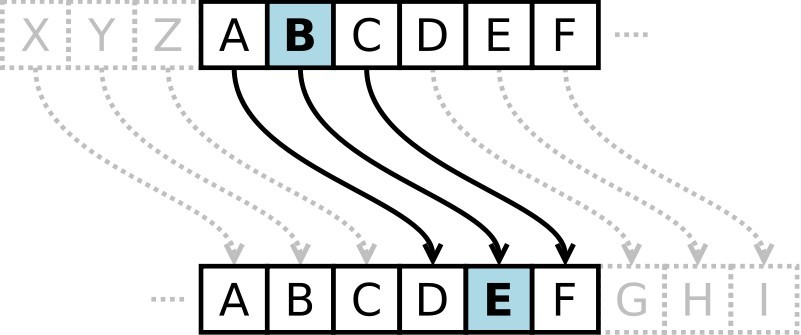
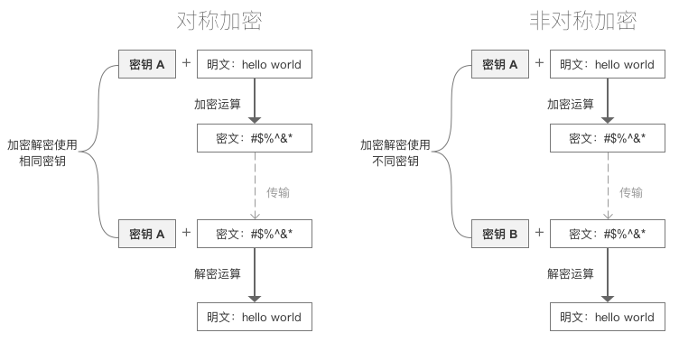

# Java密码学相关知识梳理
## ASCII编码
* ASCII（American Standard Code for Information Interchange，美国信息交换标准代码）是基于拉丁字母的一套电脑编码系统，主要用于显示现代英语和其他西欧语言。。
* 
* 实例代码:
```$java
public static void main(String[] args) {
        char a = 'A';
        int code = a;
        System.out.println(code);

        String s = "frank";
        char[] chars = s.toCharArray();
        for (char c : chars) {
            int num = c;
            System.out.println(num);
        }
}
```
## 凯撒加密
* 恺撒密码（Caesar cipher）是一种相传尤利乌斯·恺撒曾使用过的密码。恺撒于公元前100年左右诞生于古罗马，是一位著名的军事统帅。
* 恺撤密码是通过将明文中所使用的字母表按照一定的字数“平移”来进行加密的
* 
* 凯撒密码加解密公式
  
    - 加密
  
         
  
    - 解密
    
        
      
  
  - 凯撒密码中的加密三要素
    - 明文/密文
      - 明文: 图表上部分的数据
      - 密文: 图表下部分的数据
    - 秘钥
      - 按照上图秘钥为3
    - 算法
      - 加密: +3
      - 解密: -3
* 示例代码如下:
```$java
public static void main(String[] args) {
        String s = "frank";
        int key = 3;
        String encriptData = KaiserEncrypt(s, key);
        System.out.println("encriptData="+encriptData);
        String decriptData = KaiserDecrypt(encriptData, key);
        System.out.println("decriptData="+decriptData);
        /**
         * result as below:
         * encriptData=iudqn
         * decriptData=frank
         */
    }

    /**
     *
     * @param orignal:原文
     * @param key:秘钥
     * @return:返回值
     */
    private static String KaiserEncrypt(String orignal, int key) {
        char[] chars = orignal.toCharArray();
        StringBuilder sb = new StringBuilder();
        for (char aChar : chars) {
            // 获取字符的ASCII编码
            int asciiCode = aChar;
            // 偏移数据
            asciiCode += key;
            // 将偏移后的数据转为字符
            char result = (char) asciiCode;
            // 拼接数据
            sb.append(result);
        }
        return sb.toString();
    }

    /**
     *
     * @param encryptedData 密文
     * @param key 秘钥
     * @return
     */
    private static String KaiserDecrypt(String encryptedData, int key) {
        char[] chars = encryptedData.toCharArray();
        StringBuilder sb = new StringBuilder();
        for (char aChar : chars) {
            int asciiCode = aChar;
            asciiCode -= key;
            char result = (char) asciiCode;
            sb.append(result);
        }
        return sb.toString();
    }
```
## 频度分析法破解恺撒加密
- 将明文字母的出现频率与密文字母的频率相比较的过程
- 通过分析每个符号出现的频率而轻易地破译代换式密码
- 在每种语言中，冗长的文章中的字母表现出一种可对之进行分辨的频率。
- e是英语中最常用的字母，其出现频率为八分之一
- 由于破解太简单,在此不贴代码了,有兴趣的自己试试

## 对称加密
> 以分组为单位进行处理的密码算法称为**分组密码（blockcipher）**

- 对称加密采用单钥密码系统的加密方法，同一个密钥可以同时用作信息的加密和解密，这种加密方法称为对称加密，也称为单密钥加密。
- 示例
  - 我们现在有一个原文3要发送给B
  - 设置密钥为108, 3 * 108 = 324, 将324作为密文发送给B
  - B拿到密文324后, 使用324/108 = 3 得到原文
- 常见对称加密算法
  - DES : Data Encryption Standard，即数据加密标准，是一种使用密钥加密的块算法，1977年被美国联邦政府的国家标准局确定为联邦资料处理标准（FIPS），并授权在非密级政府通信中使用，随后该算法在国际上广泛流传开来。
  - AES : Advanced Encryption Standard, 高级加密标准 .在密码学中又称Rijndael加密法，是美国联邦政府采用的一种区块加密标准。这个标准用来替代原先的DES，已经被多方分析且广为全世界所使用。
- 特点
  - 加密速度快, 可以加密大文件
  - 密文可逆, 一旦密钥文件泄漏, 就会导致数据暴露
  - 加密后编码表找不到对应字符, 出现乱码
  - 一般结合Base64使用 

- 分组密码的模式
    1. 按位异或
    
       - 第一步需要将数据转换为二进制
    
       - 按位异或操作符: ^
    
       - 两个标志位进行按位异或操作:
    
         - 相同为0, 不同为1
    
       - 举例:
    
         ```go
         1 0 0 0   ----> 8
         1 0 1 1   ----> 11
         -----------------------按位异或一次
         0 0 1 1   ---->  3
         1 0 1 1   ----> 11
         -----------------------按位异或两侧
         1 0 0 0   -----> 8
         =================================
         a = 8
         b = 11
         a 和 b按位异或1次 ==> 加密
         得到的结果再次和 b 按位异或 ===> 解密
         ```
    
    2. ECB - Electronic Code Book, 电子密码本模式
    
       - 特点: 简单, 效率高, 密文有规律, 容易被破解
       - 最后一个明文分组必须要填充
         - des/3des -> 最后一个分组填充满8字节
         - aes -> 最后一个分组填充满16字节
       - 不需要初始化向量
    
    3. CBC - Cipher Block Chaining, 密码块链模式
    
       - 特点: 密文没有规律, 经常使用的加密方式
       - 最后一个明文分组需要填充
         - des/3des -> 最后一个分组填充满8字节
         - aes -> 最后一个分组填充满16字节
       - 需要一个初始化向量 - 一个数组
         - 数组的长度: 与明文分组相等
         - 数据来源: 负责加密的人的提供的
         - 加解密使用的初始化向量值必须相同
    
    4. CFB - Cipher FeedBack, 密文反馈模式
    
       - 特点: 密文没有规律,  明文分组是和一个数据流进行的按位异或操作, 最终生成了密文
       - 需要一个初始化向量 - 一个数组
         - 数组的长度: 与明文分组相等
         - 数据来源: 负责加密的人的提供的
         - 加解密使用的初始化向量值必须相同
       - 不需要填充
    
    5. OFB - Output-Feedback, 输出反馈模式
    
       - 特点: 密文没有规律,  明文分组是和一个数据流进行的按位异或操作, 最终生成了密文
       - 需要一个初始化向量 - 一个数组
         - 数组的长度: 与明文分组相等
         - 数据来源: 负责加密的人的提供的
         - 加解密使用的初始化向量值必须相同
       - 不需要填充
    
    6. CTR - CounTeR, 计数器模式
    
       - 特点: 密文没有规律,  明文分组是和一个数据流进行的按位异或操作, 最终生成了密文
       - 不需要初始化向量
       - 不需要填充
    
    7. 最后一个明文分组的填充
    
       - 使用cbc, ecb需要填充
         - 要求: 
           - 明文分组中进行了填充, 然后加密
           - 解密密文得到明文, 需要把填充的字节删除
       - 使用 ofb, cfb, ctr不需要填充
    
    8. 初始化向量 - IV
    
       - ecb, ctr模式不需要初始化向量
       - cbc, ofc, cfb需要初始化向量
         - 初始化向量的长度
           - des/3des -> 8字节
           - aes -> 16字节
         - 加解密使用的初始化向量相同
         
 - DES加密示例代码如下:
    - DES加密,key的大小必须是8个字节
    - 如果没有指定分组密码模式和填充模式,ECB/PKCS5Padding就是默认值
    - 如果指定分组密码模式为CBC,必须指定初始向量,初始向量中密钥的长度必须是8个字节
    - 如果没有指定填充模式为NoPadding模式,原文的长度必须是8个字节的整倍数
 ```$xslt
 public class DESDemo {
     // DES加密算法,key的大小必须是8个字节
     public static void main(String[] args) throws Exception {
         String input = "frank";
         String key = "12345678";
         // 指定获取Cipher的算法,如果没有指定分组密码模式和填充模式,ECB/PKCS5Padding就是默认值
         // CBC模式,必须指定初始向量,初始向量中密钥的长度必须是8个字节
         // NoPadding模式,原文的长度必须是8个字节的整倍数
 //        String transformation = "DES";
         String transformation = "DES/CBC/PKCS5Padding";
         // 指定获取密钥的算法
         String algorithm = "DES";
         String encryptDES = DESEncrypt(input, key, transformation, algorithm);
         System.out.println("加密:" + encryptDES);
         String s = DESDecrypt(encryptDES, key, transformation, algorithm);
         System.out.println("解密:" + s);
     }
 
     /**
      *
      * @param input  明文
      * @param key   密钥(DES,密钥的长度必须是8个字节)
      * @param transformation  获取Cipher对象的算法
      * @param algorithm   获取密钥的算法
      * @return  返回密文
      * @throws Exception
      */
     private static String DESEncrypt(String input, String key, String transformation, String algorithm) throws Exception {
         // 1,获取Cipher对象
         Cipher cipher = Cipher.getInstance(transformation);
         // 指定密钥规则
         SecretKeySpec sks = new SecretKeySpec(key.getBytes(), algorithm);
         // 2.初始化向量的秘钥长度需要根据算法而定,des 8个字节长度  aes 16个字节长度
         //这里为了方便,统一使用传来的秘钥
         IvParameterSpec iv = new IvParameterSpec(key.getBytes());
         cipher.init(Cipher.ENCRYPT_MODE, sks, iv);
 //        cipher.init(Cipher.ENCRYPT_MODE, sks);
         // 3. 加密
         byte[] bytes = cipher.doFinal(input.getBytes());
         // 对数据进行Base64编码
         String encode = Base64.encode(bytes);
         return encode;
     }
 
    
     private static String DESDecrypt(String input, String key, String transformation, String algorithm) throws Exception {
         Cipher cipher = Cipher.getInstance(transformation);
         SecretKeySpec sks = new SecretKeySpec(key.getBytes(), algorithm);
         IvParameterSpec iv = new IvParameterSpec(key.getBytes());
         cipher.init(Cipher.DECRYPT_MODE, sks, iv);
 //         cipher.init(Cipher.DECRYPT_MODE, sks);
         byte[] bytes = cipher.doFinal(Base64.decode(input));
         return new String(bytes);
     }
 }
```
  - AES加密示例代码如下(AES和DES加密高度类似)
     - AES加密,key的大小必须是16个字节
     - 如果没有指定分组密码模式和填充模式,ECB/PKCS5Padding就是默认值
     - 如果没有指定分组密码模式为CBC,必须指定初始向量,初始向量中密钥的长度必须是16个字节
     - 如果没有指定填充模式为NoPadding模式,原文的长度必须是16个字节的整倍数
```$xslt
public class AESDemo {
    // AES加密算法,key的大小必须是16个字节
    public static void main(String[] args) throws Exception {
        String input = "frank";
        String key = "1234567887654321";
        // 指定获取Cipher的算法,如果没有指定分组密码模式和填充模式,ECB/PKCS5Padding就是默认值
        // CBC模式,必须指定初始向量,初始向量中密钥的长度必须是16个字节
        // NoPadding模式,原文的长度必须是16个字节的整倍数
//        String transformation = "AES";
        String transformation = "AES/CBC/PKCS5Padding";
        // 指定获取密钥的算法
        String algorithm = "AES";
        String encryptAES = AESEncrypt(input, key, transformation, algorithm);
        System.out.println("加密:" + encryptAES);
        String s = AESDecrypt(encryptAES, key, transformation, algorithm);
        System.out.println("解密:" + s);
    }

    /**
     *
     * @param input  明文
     * @param key   密钥(AES,密钥的长度必须是16个字节)
     * @param transformation  获取Cipher对象的算法
     * @param algorithm   获取密钥的算法
     * @return  返回密文
     * @throws Exception
     */
    private static String AESEncrypt(String input, String key, String transformation, String algorithm) throws Exception {
        // 1,获取Cipher对象
        Cipher cipher = Cipher.getInstance(transformation);
        // 指定密钥规则
        SecretKeySpec sks = new SecretKeySpec(key.getBytes(), algorithm);
        // 2.初始化向量的秘钥长度需要根据算法而定,des 8个字节长度  aes 16个字节长度
        //这里为了方便,统一使用传来的秘钥
        IvParameterSpec iv = new IvParameterSpec(key.getBytes());
        cipher.init(Cipher.ENCRYPT_MODE, sks, iv);
//        cipher.init(Cipher.ENCRYPT_MODE, sks);
        // 3. 加密
        byte[] bytes = cipher.doFinal(input.getBytes());
        // 对数据进行Base64编码
        String encode = Base64.encode(bytes);
        return encode;
    }


    private static String AESDecrypt(String input, String key, String transformation, String algorithm) throws Exception {
        Cipher cipher = Cipher.getInstance(transformation);
        SecretKeySpec sks = new SecretKeySpec(key.getBytes(), algorithm);
        IvParameterSpec iv = new IvParameterSpec(key.getBytes());
        cipher.init(Cipher.DECRYPT_MODE, sks, iv);
//         cipher.init(Cipher.DECRYPT_MODE, sks);
        byte[] bytes = cipher.doFinal(Base64.decode(input));
        return new String(bytes);
    }
}

```